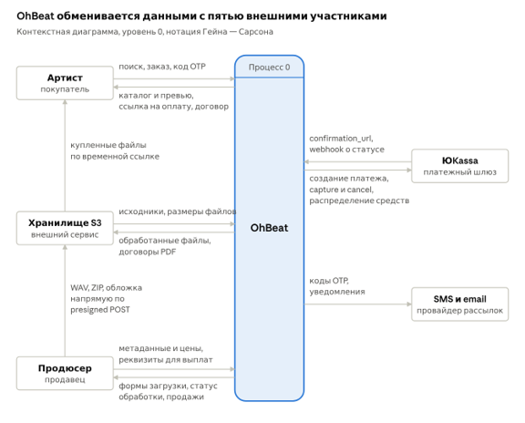

# 🌐 Контекстная модель системы (DFD Level 0)

Диаграмма потоков данных нулевого уровня (в нотации Гейна — Сарсона) описывает маркетплейс OhBeat как единый центральный процесс («черный ящик») и фиксирует границы системы через информационный обмен с внешними сущностями.

---

## 1. Контекстная диаграмма

Система взаимодействует с пятью внешними участниками. Каждая пара стрелок отражает передачу данных: входящие потоки в OhBeat и исходящие потоки из системы.

---

## 2. Внешние участники и потоки данных

### 2.1. Пользовательские роли
* **Артист (покупатель):**
  * *В систему:* поисковые запросы, параметры формируемого заказа, одноразовые OTP-коды для подписания договора.
  * *Из системы:* выдача каталога и аудиопревью, ссылки на оплату заказа, сгенерированные лицензионные договоры.
* **Продюсер (продавец):**
  * *В систему:* метаданные треков, ценовая матрица лицензий, реквизиты для получения выплат.
  * *Из системы:* формы загрузки контента, статусы асинхронной обработки файлов, уведомления о продажах.

### 2.2. Внешние сервисы и интеграции
* **ЮKassa (платежный шлюз):**
  * *В систему:* URL для перенаправления покупателя (`confirmation_url`), вебхуки о смене статусов платежей.
  * *Из системы:* команды на создание платежей, подтверждение (`capture`) или отмену (`cancel`) холдирования, параметры распределения средств между платформой и продавцом.
* **SMS и email (провайдер рассылок):**
  * *Из системы:* запросы на доставку одноразовых кодов (OTP) для электронного подписания (ПЭП) и транзакционных уведомлений пользователям.
* **Хранилище S3 (внешний сервис):**
  * *В систему:* метаданные объектов (исходники, фактические размеры файлов).
  * *Из системы:* обработанные медиафайлы (чистые MP3, превью с войстегами), сгенерированные PDF-договоры.

---

## 3. Архитектурная особенность потоков S3

Ключевой особенностью системы является оптимизация трафика для тяжелых медиафайлов. Передача бинарных данных происходит **напрямую** между клиентами и объектным хранилищем, минуя сервер приложений OhBeat:
1. **Продюсер $\rightarrow$ S3:** загрузка оригинальных исходников (мастер WAV, стемы ZIP, обложки) выполняется напрямую по политикам `presigned POST`.
2. **S3 $\rightarrow$ Артист:** скачивание купленных файлов выполняется напрямую из защищенных бакетов по временным ссылкам. 

*Сервер OhBeat в этих потоках выступает только центром выдачи прав (генерации подписанных ссылок), но не проксирует сами файлы (см. [Функциональные требования](FR_NFR.md)).*