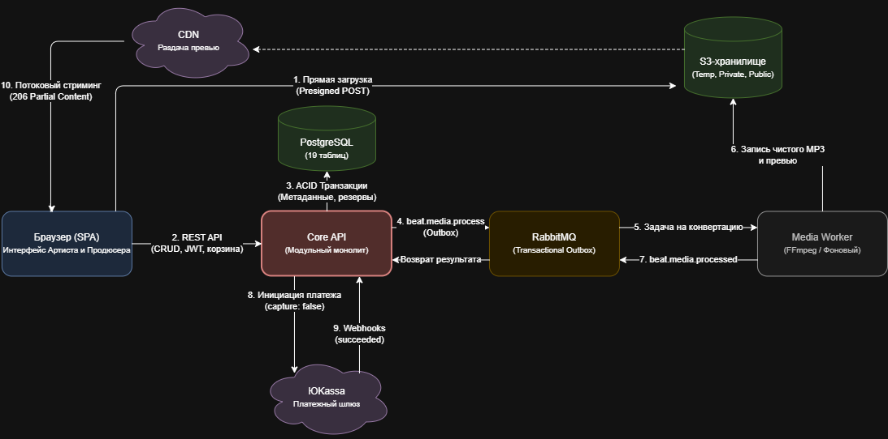

# 🏛️ Базовая и компонентная архитектура системы (System Architecture)

В данном документе описана базовая трехслойная архитектура маркетплейса OhBeat, выбранный паттерн проектирования, а также детальный состав компонентной базы.

---

## 1. Базовая трехслойная архитектура системы

Система разделена на три логических слоя. Главное архитектурное решение: тяжелые медиафайлы передаются из браузера напрямую в S3 и из S3 напрямую покупателю по временным presigned-ссылкам (через CDN раздаются только публичные превью и обложки), в то время как Core API оперирует исключительно легковесными метаданными и генерацией ссылок.

| Слой системы | Компоненты | Зона ответственности и функции |
| :--- | :--- | :--- |
| **Представление (Presentation Layer)** | SPA в браузере (интерфейсы Артиста и Продюсера), CDN | Отрендеренные экранные формы, клиентская валидация, плеер превью, загрузка файлов в S3 по Presigned-ссылкам. |
| **Бизнес-логика (Business Logic Layer)** | Core API (модульный монолит), Media Worker, фоновый планировщик | Реализация бизнес-правил каталога, заказов, резервов, оплат и договоров; асинхронная обработка аудио; плановое снятие истекших резервов. |
| **Данные (Data Layer)** | PostgreSQL, S3 (временный, приватный, публичный бакеты), RabbitMQ | Персистентное хранение метаданных и транзакций, хранение медиафайлов и договоров, асинхронная очередь сообщений в RabbitMQ. |

Внешние системы (платежный шлюз ЮKassa, провайдер SMS/Email) интегрируются на уровне слоя бизнес-логики Core API.

 Ниже на диаграмме продемонстрировано взаимодействие описанных компонентов и потоки данных между ними:
 

---

## 2. Архитектурный паттерн: Гибридная архитектура (Модульный монолит + Воркер)

Для реализации бэкенд-логики OhBeat выбран паттерн **Модульный монолит с выделенным асинхронным воркером (Hybrid Architecture)**.

### 2.1. Обоснование выбора архитектурного решения
* **Почему не чистый монолит:** Операции по конвертации аудио, наложению голосовых меток (войстегов) и распаковке ZIP-архивов размером до 1 ГБ являются тяжелыми блокирующими задачами, нагружающими процессор. Если выполнять их внутри основного синхронного монолита, одновременная публикация нескольких битов приведет к зависанию сервера и деградации времени отклика каталога и заказов (нарушение NFR-1).
* **Почему не чистые микросервисы:** Накладные расходы на инфраструктуру (Kubernetes, Service Mesh, распределенные транзакции) избыточны и не окупаются на стадии MVP. Для финансовых транзакций, проведения оплат и смены владельца эксклюзивных прав критически важна строгая гарантия ACID, которую надежнее и проще реализовать в рамках единой реляционной базы данных PostgreSQL.
* **Преимущества модульности:** Код Core API разделен на логические изолированные модули по предметным областям с четкими границами взаимодействия. В дальнейшем, по мере роста нагрузки, любой модуль можно бесшовно вынести в независимый микросервис.

---

## 3. Компоненты системы и их взаимодействие

| Компонент | Назначение и технологическая роль | Источники входящих вызовов |
| :--- | :--- | :--- |
| **Core API** | Единый модуль бизнес-логики (монолит). Обрабатывает REST-запросы, управляет JWT-авторизацией, каталогом, корзиной, заказами, резервами, платежными вебхуками и генерацией договоров. | Клиентский браузер (SPA), платежный шлюз ЮKassa (Webhooks). |
| **Outbox Relay** | Внутренний фоновый процесс Core API. Осуществляет надежную публикацию событий из таблицы `outbox` в брокер RabbitMQ. | Работает по внутреннему таймеру Core API. |
| **Планировщик (Scheduler)** | Фоновый сервис для автоматического выполнения периодических системных задач (снятие истекших 15-минутных резервов битов, очистка зависших загрузок). | Запускается по внутреннему расписанию (Cron). |
| **PostgreSQL** | Централизованная реляционная база данных для всех транзакционных данных и справочников Core API. | Исключительно модуль Core API. |
| **RabbitMQ** | Асинхронный брокер сообщений. Обеспечивает разделение потоков и передачу тяжелых фоновых задач (`beat.media.process`). | Core API и Media Worker. |
| **Media Worker** | Изолированный микросервис обработки медиа (воркер-консьюмер). Не принимает HTTP-запросы, слушает очередь RabbitMQ, выполняет проверку архивов и FFmpeg-обработку файлов, возвращая результат через события. |
| **S3 Storage** | Объектное хранилище, разделенное на три логических бакета: `temp` (сырые файлы, автоочистка через 24ч), `private` (мастер-файлы, стемы, договоры), `public` (превью и обложки). | Клиентский браузер (по Presigned URL), CDN, Core API, Media Worker. |
| **CDN** | Сеть доставки контента для быстрой раздачи публичных превью-аудиофайлов и обложек по всему миру. | Клиентские плееры из браузеров. |