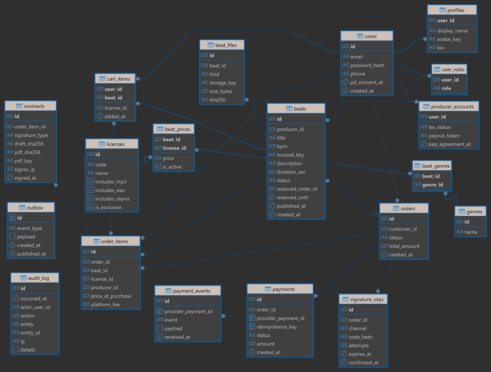
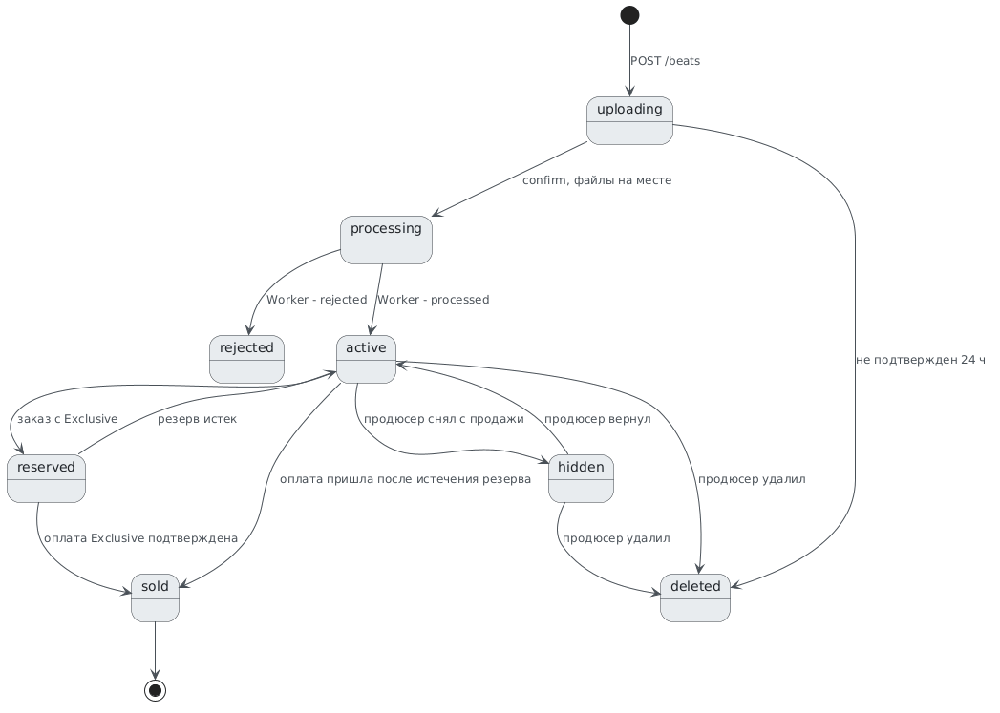
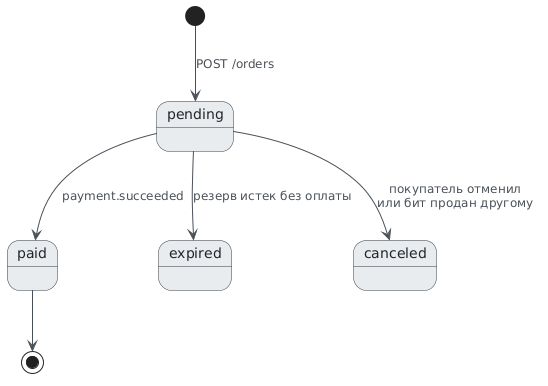

# 🗄️ Физическая модель данных (PostgreSQL)

СУБД проекта — PostgreSQL: ACID-транзакции необходимы для надежного механизма резервирования битов и смены статусов, а внешние ключи исключают возможность удаления продюсера с активными продажами или покупку несуществующей лицензии.

## 1. Соглашения по типам данных и архитектуре
* **Первичные ключи:** `BIGINT GENERATED ALWAYS AS IDENTITY`.
* **Денежные суммы:** `NUMERIC(10,2)`.
* **Ключи идемпотентности и ID событий:** `UUID`.
* **Время:** `TIMESTAMPTZ` (хранится строго в UTC согласно [NFR-29](../01_Requirements/FR_NFR.md)).
* **Статусы:** `VARCHAR` с ограничением `CHECK` на допустимые значения.
* **Удаление данных:** Удаление пользователей и битов является логическим (через смену статуса), чтобы не ломать историю покупок.

---

## 2. Общая ER-диаграмма базы данных

Физическая модель полностью нормализована и состоит из 19 взаимосвязанных таблиц.



Физическая модель логически разделена на три предметные области и служебный контур:

### 2.1. Пользователи
Включает сущности: 
* `users` — базовая таблица учетных записей.
* `user_roles` — роли пользователей (`artist`, `producer`, `admin`).
* `profiles` — публичный профиль (имя, аватар, биография).
* `producer_accounts` — данные продавца (налоговый статус, токен для выплат, согласие на ПЭП).

### 2.2. Каталог
Включает сущности:
* `beats` — основная таблица битов (музыкальные характеристики, статус, данные о резерве).
* `genres` и `beat_genres` — справочник жанров и таблица связи многие-ко-многим.
* `beat_files` — медиафайлы (мастер, стемы, чистый mp3, превью, обложка) со ссылками на S3 и хэшами.
* `licenses` и `beat_prices` — справочник лицензий и выставленные цены на конкретный бит.

### 2.3. Корзина, заказы, платежи и договоры
Включает сущности:
* `cart_items` — корзина покупателя.
* `orders` и `order_items` — заказы и позиции в них. Поля подписи вынесены из заказа в отдельную таблицу `contracts`, так как заказ может содержать несколько битов разных продюсеров, и договор заключается на каждую позицию.
* `payments` и `payment_events` — платежи и входящие уведомления от ЮKassa.
* `signature_otps` — коды OTP для подписания эксклюзивных прав.

**Служебные таблицы (без внешних связей):**
* `outbox` — инфраструктурная таблица для брокера RabbitMQ.
* `audit_log` — системный журнал действий.

---

## 3. Ключевые ограничения целостности (Constraints)

| Таблица | Ограничение | Зачем |
| --- | --- | --- |
| `beats` | `CHECK (status IN ('uploading','processing','active','reserved','sold','rejected','hidden','deleted'))` | Одна статусная модель вместо статуса плюс флага `is_exclusive_sold` |
| `beats` | `CHECK ((status = 'reserved') = (reserved_order_id IS NOT NULL AND reserved_until IS NOT NULL))` | Резерв всегда знает свой заказ и срок |
| `beat_prices` | `CHECK (price BETWEEN 100 AND 500000)` | Те же границы, что в API и экранных формах |
| `beat_files` | `UNIQUE (beat_id, kind)` | По одному файлу каждого вида на бит |
| `order_items` | `UNIQUE (order_id, beat_id)` | Один бит — одна позиция в заказе |
| `payment_events` | `UNIQUE (provider_payment_id, event)` | Повторный вебхук не обработается дважды |
| `payments` | `UNIQUE (idempotence_key)` | Повтор запроса к ЮKassa не создаст второй платеж |
| `audit_log` | `REVOKE UPDATE, DELETE` у роли приложения | Журнал только на добавление (согласно [NFR-32](../01_Requirements/FR_NFR.md)) |
| `beats` | Частичный индекс `(reserved_until) WHERE status = 'reserved'` | Быстрый поиск истекших резервов |

---

## 4. Статусная модель бита



---

## 5. Статусные модели заказа и платежа



**Жизненный цикл платежа:** `pending` → `waiting_for_capture` (деньги заблокированы) → `succeeded` (списаны) или `canceled` (отказ банка, отмена при проверке [FR-23](../01_Requirements/FR_NFR.md)). У заказа может быть несколько платежей, если первая попытка не удалась.

---

## 6. Снятие истекших резервов

Запрос фоновой задачи (согласно [FR-29](../01_Requirements/FR_NFR.md)), запускается раз в минуту:

```sql
WITH expired AS (
    UPDATE beats
    SET status = 'active', reserved_order_id = NULL, reserved_until = NULL
    WHERE status = 'reserved' AND reserved_until < now()
    RETURNING id
)
UPDATE orders o
SET status = 'expired'
WHERE o.status = 'pending'
  AND EXISTS (
      SELECT 1 FROM order_items oi
      JOIN expired e ON e.id = oi.beat_id
      WHERE oi.order_id = o.id
  );
```

Задержка снятия до одной минуты допустима: она лишь чуть дольше держит бит в резерве и не создает двойных продаж, так как продажа проверяется в момент холдирования средств (FR-23).