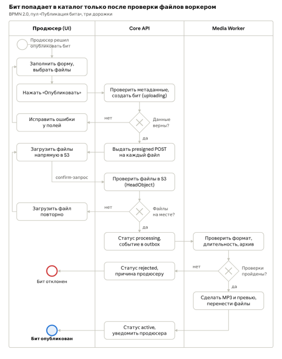

# 🔄 Модель бизнес-процесса публикации бита (BPMN 2.0)

Бизнес-процесс регламентирует сквозной жизненный цикл публикации музыкального контента: от ввода метаданных автором в интерфейсе до валидации исходников, прямой загрузки в объектное хранилище S3, асинхронной обработки аудио и вывода трека на витрину маркетплейса.

Архитектурная особенность процесса — **прямая передача бинарных файлов из браузера в S3** по Presigned POST URL, минуя сервер приложений Core API. Это разгружает бэкенд и распределяет проверки по трем независимым эшелонам.

---

## 1. Диаграмма бизнес-процесса

Процесс представлен в виде единого пула «Публикация бита», разделенного на три дорожки (swimlanes), с последовательным вертикальным потоком управления и тремя точками ветвления (шлюзами).

---

## 2. Дорожки и зоны ответственности (Lanes)

| Дорожка (Lane) | Роль / Компонент | Зона ответственности |
| :--- | :--- | :--- |
| **Продюсер (UI)** | Frontend (SPA в браузере) | Заполнение веб-формы, первичная клиентская валидация, параллельная отправка файлов в S3 с отображением прогресс-бара, корректировка данных при возвратах. |
| **Core API** | Сервер приложений (бэкенд) | Проверка метаданных и стоп-листов, генерация политик Presigned POST, подтверждение наличия объектов через `HeadObject`, атомарная смена статусов и запись событий в Outbox. |
| **Media Worker** | Фоновый микросервис | Глубокий анализ медиапотоков (FFmpeg/ffprobe), антивирусное сканирование, генерация чистого MP3 и превью с войстегом, миграция файлов между бакетами. |

---

## 3. Этапы процесса и логика ветвления

### 3.1. Инициализация и первый шлюз: «Данные верны?»
1. Продюсер заполняет карточку бита (название, жанры, BPM, тональность, сетка цен) и выбирает файлы (мастер WAV, обложка, ZIP со стемами при необходимости) согласно [FR/NFR](../01_Requirements/FR_NFR.md).
2. По нажатию кнопки «Опубликовать» клиент отправляет запрос `POST /v1/beats` (см. [REST API Contracts](../03_API_and_Integrations/REST_API_Contracts.md)).
3. Core API валидирует поля на допустимые диапазоны и стоп-слова.
4. **Шлюз 1 (Данные верны?):**
   * **[Нет]:** Core API возвращает ошибку `400 VALIDATION_ERROR`. Продюсер переходит к шагу *«Исправить ошибки у полей»* — форма подсвечивает некорректные инпуты без сброса введенных данных.
   * **[Да]:** Core API создает бит в статусе `uploading` и возвращает адреса и политики Presigned POST со сроком жизни 1 час ([FR/NFR](../01_Requirements/FR_NFR.md)).

### 3.2. Прямая загрузка и второй шлюз: «Файлы на месте?»
1. Фронтенд выполняет прямую загрузку файлов в бакет `temp-uploads` хранилища S3.
2. После успешной загрузки клиент автоматически инициирует подтверждение — запрос `POST /v1/beats/{id}/confirm` (см. [FR/NFR](../01_Requirements/FR_NFR.md)).
3. Core API выполняет быстрый синхронный запрос `HeadObject` в S3 по каждому файлу для проверки их фактического наличия и заявленных размеров.
4. **Шлюз 2 (Файлы на месте?):**
   * **[Нет]:** Возвращается ошибка `422 FILES_MISSING`. Процесс направляет Продюсера к шагу *«Загрузить файл повторно»* только для незагруженных или поврежденных файлов.
   * **[Да]:** В рамках одной транзакции БД бит переводится в статус `processing`, а задача на конвертацию сохраняется в таблицу `outbox` (см. [Асинхронное взаимодействие RabbitMQ](../04_Message_Broker/RabbitMQ_Worker.md)). Фоновый релей передает сообщение `beat.media.process` в брокер.

### 3.3. Медиаобработка и третий шлюз: «Проверки пройдены?»
1. Media Worker вычитывает команду из RabbitMQ, скачивает исходники из временного бакета и проводит асинхронный анализ согласно [FR/NFR](../01_Requirements/FR_NFR.md):
   * WAV: анализ PCM-структуры через `ffprobe`, проверка длительности (до 10 минут);
   * ZIP: распаковка в память, сканирование антивирусом, проверка отсутствия исполняемых и посторонних файлов.
2. **Шлюз 3 (Проверки пройдены?):**
   * **[Нет]:** Воркер публикует сообщение-результат со статусом `rejected` и текстом ошибки. Core API переводит бит в статус `rejected` и отправляет автору системное уведомление. Процесс завершается конечным событием **«Бит отклонен»**.
   * **[Да]:** Воркер нарезает чистый MP3 320 кбит/с, генерирует MP3 128 кбит/с с наложением цикличного войстега и раскладывает объекты по постоянным бакетам (приватный и публичный за CDN). По событию `processed` Core API меняет статус бита на `active` и уведомляет автора. Процесс успешно завершается событием **«Бит опубликован»**.

---

## 4. Граничные сценарии и отказоустойчивость

* **Циклы исправления ошибок:** Ветвления на первых двух шлюзах возвращают процесс к пользовательским шагам без сброса контекста сессии, обеспечивая непрерывность UX.
* **Инфраструктурные сбои воркера:** Временные ошибки сети или недоступности S3 не отображаются как бизнес-шлюзы на диаграмме. Они изолированы внутри брокера сообщений через механизм очередей задержки с NACK и до 3 повторных попыток обработки (см. [Асинхронное взаимодействие RabbitMQ](../04_Message_Broker/RabbitMQ_Worker.md)).
* **Таймаут подтверждения загрузки:** Если продюсер начал загрузку, но не нажал подтверждение в течение 24 часов, планировщик и жизненные циклы S3 удаляют «зависшую» запись и временные файлы согласно [FR/NFR](../01_Requirements/FR_NFR.md).