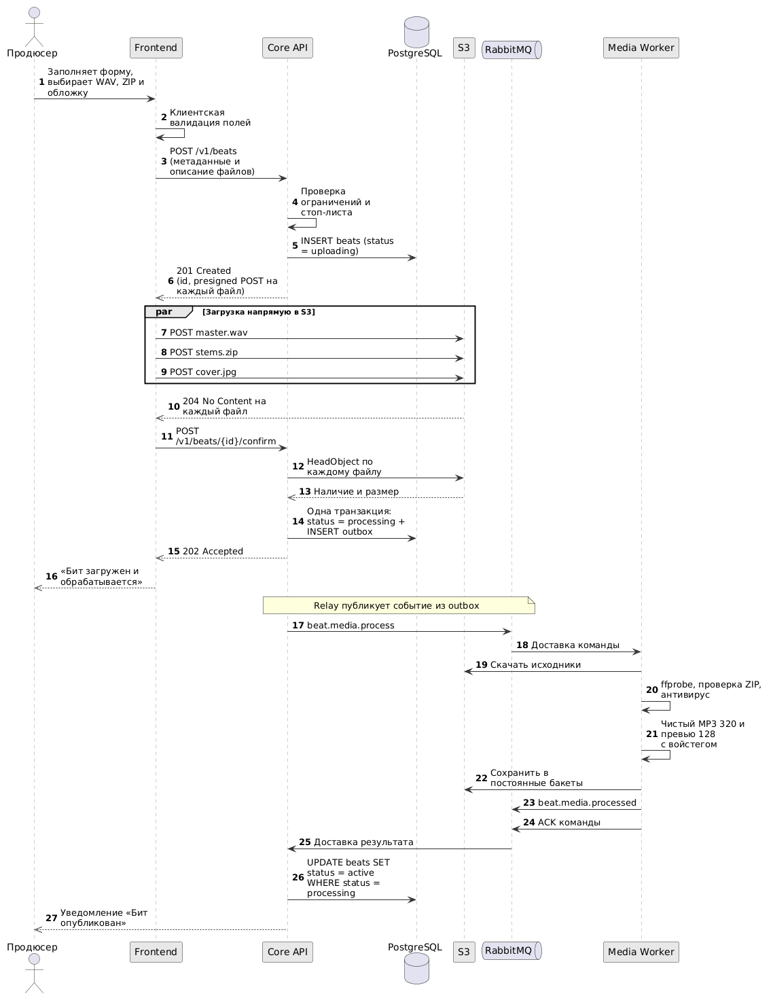
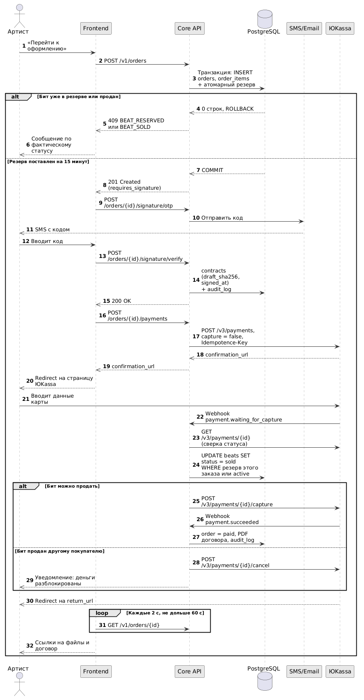

# ⏱️ Диаграммы последовательности (UML Sequence)

В данном разделе представлены диаграммы последовательности, описывающие два ключевых транзакционных процесса маркетплейса: сквозную публикацию музыкального контента и оформление заказа с подписанием эксклюзивного договора и оплатой.

Диаграммы отражают распределение ответственности между компонентами системы, асинхронное взаимодействие через брокер сообщений и механизм надежной фиксации транзакций.

---

## 1. Сквозной сценарий публикации бита

Процесс иллюстрирует взаимодействие компонентов при создании новой карточки товара в каталоге. Ключевая архитектурная особенность — применение паттерна Transactional Outbox для надежной передачи события на конвертацию аудиофайлов.

### 1.1. Диаграмма взаимодействия

### 1.2. Описание шагов

1. **Инициализация и загрузка:** Продюсер заполняет форму и отправляет метаданные в Core API. При успешной проверке ограничений сервер регистрирует бит в статусе `uploading` и выдает временные Presigned POST-ссылки. Загрузка тяжелых медиафайлов происходит из браузера напрямую в хранилище S3, минуя application-сервер (см. [Функциональные требования](../01_Requirements/FR_NFR.md)).
2. **Атомарное подтверждение:** После завершения загрузки Frontend отправляет запрос на подтверждение (`confirm`). Core API запрашивает у S3 метаданные объектов (`HeadObject`). Если файлы на месте, сервер в рамках **одной ACID-транзакции** переводит статус бита в `processing` и сохраняет задачу для воркера в служебную таблицу `outbox`.
3. **Асинхронная обработка:** Внутренний Relay-процесс считывает задачу из `outbox` и публикует событие в RabbitMQ. Изолированный микросервис (Media Worker) скачивает исходники, проверяет длительность и форматы (FFmpeg/ffprobe), выполняет антивирусную проверку ZIP-архивов и генерирует MP3-превью с наложением защитного войстега (см. [Архитектура очереди](../04_Message_Broker/RabbitMQ_Worker.md)).
4. **Завершение:** Воркер сохраняет готовые файлы в постоянные бакеты S3 и отправляет результат обработки обратно в брокер. Core API вычитывает результат, активирует карточку товара в каталоге (статус `active`) и уведомляет Продюсера.

---

## 2. Сценарий покупки лицензии Exclusive

Процесс иллюстрирует алгоритм безопасного приобретения эксклюзивных прав. Сценарий включает конкурентную блокировку ресурса, подписание юридически значимого договора простой электронной подписью (ПЭП) и проведение двухстадийного платежа.

### 2.1. Диаграмма взаимодействия

### 2.2. Описание шагов

1. **Резервирование:** Артист инициирует оформление заказа. Core API атомарно проверяет доступность бита на уровне СУБД. Если бит свободен, устанавливается жесткий транзакционный резерв на 15 минут, исключающий параллельные продажи.
2. **Подписание договора:** Поскольку приобретаются эксклюзивные права, Артист обязан подписать лицензионный договор. Core API генерирует черновик, вычисляет его хэш-сумму (SHA-256) и инициирует отправку OTP-кода через внешнего провайдера SMS/Email. После успешного ввода кода факт подписания фиксируется в базе данных и неизменяемом Audit Log (см. [RFC по цифровой подписи](../02_Architecture/RFC_Digital_Signature.md)).
3. **Холдирование средств:** Core API создает платежную сессию в ЮKassa с параметром `capture: false` (двухстадийная оплата) и перенаправляет покупателя на платежный шлюз. Средства блокируются на карте Артиста.
4. **Списание и подтверждение (Webhook):** При поступлении уведомления от ЮKassa о холдировании (`waiting_for_capture`) Core API проверяет возможность завершения сделки:
   * **Штатный сценарий:** Резерв этого заказа активен (`status = 'reserved'` и `reserved_order_id = :order_id`) — сервер подтверждает списание (`capture`).
   * **Сценарий с опозданием:** 15-минутный резерв истек, но бит вернулся в статус `active` и не занят другим покупателем — сервер подтверждает списание (`capture`).
   * **Отказ:** Бит успели выкупить или зарезервировать под другой заказ — сервер отменяет платеж (`cancel`), средства автоматически разблокируются на карте Артиста (см. [Спецификации API](../03_API_and_Integrations/REST_API_Contracts.md)).
5. **Выдача файлов:** После статуса `succeeded` бит скрывается из каталога навсегда. Сервер генерирует финальный PDF-документ со штампом электронной подписи. Фронтенд, циклически опрашивающий статус заказа, перенаправляет пользователя на страницу успешной покупки с временными ссылками на скачивание архива файлов и договора.