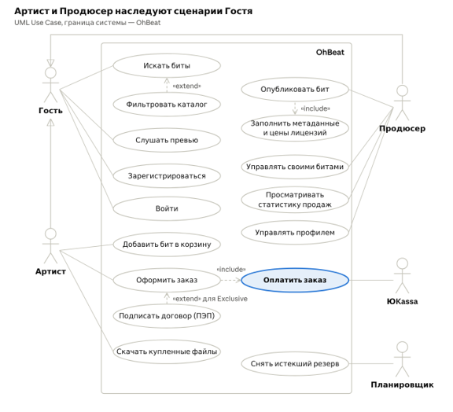

# 🎭 Модель прецедентов (UML Use Case)

Раздел определяет границы MVP маркетплейса OhBeat, распределение ролей пользователей и структуру функциональных сценариев платформы с учетом взаимодействия с внешними системами.

---

## 1. Диаграмма прецедентов

Модель включает 5 акторов и 16 вариантов использования, структурированных внутри единого системного контура платформы.

---

## 2. Акторы системы

Взаимодействие с платформой разделено между первичными (пользовательскими) и вторичными (системными) участниками:

### 2.1. Первичные акторы
* **Гость** — неавторизованный пользователь. Осуществляет навигацию по витрине, прослушивает ознакомительные фрагменты треков и проходит процедуру регистрации/входа.
* **Артист (покупатель)** — зарегистрированный исполнитель, приобретающий лицензии на инструменталы с юридическим закреплением прав и получением производных файлов.
* **Продюсер (продавец)** — зарегистрированный битмейкер, публикующий работы для продажи, настраивающий условия лицензирования и получающий выплаты.

> **Обобщение ролей (Generalization):** Артист и Продюсер связаны с Гостем отношением наследования. Они обладают всеми правами базового посетителя (поиск, фильтрация каталога, воспроизведение превью), благодаря чему данные связи не дублируются линиями к каждой роли отдельно.

### 2.2. Вторичные акторы
* **ЮKassa** — внешний платежный шлюз, обеспечивающий проведение двухстадийных транзакций, списание средств и распределение выплат (см. [FR/NFR](../01_Requirements/FR_NFR.md)).
* **Планировщик** — внутренний служебный сервис платформы, запускающий периодические фоновые процедуры, включая автоматическое освобождение невыкупленных 15-минутных резервов (см. [FR/NFR](../01_Requirements/FR_NFR.md) и [Физическую модель данных](../05_Database/Database_Schema.md)).

---

## 3. Реестр вариантов использования

| ID | Название сценария | Инициатор | Назначение и контекст реализации |
| :--- | :--- | :--- | :--- |
| **UC-1** | Искать биты | Гость | Базовый полнотекстовый поиск по каталогу (см. [REST API Contracts](../03_API_and_Integrations/REST_API_Contracts.md)) |
| **UC-2** | Фильтровать каталог | Гость | Параметрический отбор по жанру, BPM, тональности и цене (`«extend»` к UC-1) |
| **UC-3** | Слушать превью | Гость | Воспроизведение MP3 128 кбит/с с защитным войстегом (см. [RFC по стримингу аудио](../02_Architecture/RFC_Audio_Streaming.md)) |
| **UC-4** | Зарегистрироваться | Гость | Создание профиля с согласием на обработку ПДн по 152-ФЗ (см. [FR/NFR](../01_Requirements/FR_NFR.md)) |
| **UC-5** | Войти | Гость | Аутентификация с выдачей access/refresh токенов (см. [REST API Contracts](../03_API_and_Integrations/REST_API_Contracts.md)) |
| **UC-6** | Добавить бит в корзину | Артист | Выбор одного из 4 стандартных типов лицензий (см. [FR/NFR](../01_Requirements/FR_NFR.md)) |
| **UC-7** | Оформить заказ | Артист | Фиксация позиций и установка атомарного резерва на Exclusive (см. [FR/NFR](../01_Requirements/FR_NFR.md)) |
| **UC-8** | Оплатить заказ | Артист, ЮKassa | Инициация двухстадийного платежа через шлюз (`«include»` в UC-7) |
| **UC-9** | Подписать договор (ПЭП) | Артист | Верификация сделки одноразовым OTP-кодом (`«extend»` к UC-7 для Exclusive, см. [RFC по ПЭП](../02_Architecture/RFC_Digital_Signature.md)) |
| **UC-10** | Скачать купленные файлы | Артист | Получение временных presigned-ссылок в «Моих покупках» (см. [FR/NFR](../01_Requirements/FR_NFR.md)) |
| **UC-11** | Опубликовать бит | Продюсер | Загрузка медиафайлов и инициация пайплайна обработки (см. [FR/NFR](../01_Requirements/FR_NFR.md)) |
| **UC-12** | Заполнить метаданные и цены лицензий | Продюсер | Конфигурация ценовой матрицы и атрибутов трека (`«include»` в UC-11) |
| **UC-13** | Управлять своими битами | Продюсер | Корректировка цен лицензий, логическое удаление и снятие с продажи |
| **UC-14** | Просматривать статистику продаж | Продюсер | Мониторинг начисленных средств и истории приобретенных лицензий |
| **UC-15** | Управлять профилем | Продюсер | Настройка публичной карточки автора и платежных реквизитов для выплат |
| **UC-16** | Снять истекший резерв | Планировщик | Автоматический сброс просроченной 15-минутной брони (см. [FR/NFR](../01_Requirements/FR_NFR.md)) |

---

## 4. Отношения между прецедентами

1. **Связи включения (`«include»`):**
   * **Оформить заказ $\rightarrow$ Оплатить заказ:** Процедура оформления заказа не может быть завершена без проведения платежа; оплата является неотъемлемым этапом сделки.
   * **Опубликовать бит $\rightarrow$ Заполнить метаданные и цены лицензий:** Создание карточки трека обязательно требует валидации и фиксации параметров (BPM, тональность, жанры, стоимость лицензий).

2. **Связи расширения (`«extend»`):**
   * **Фильтровать каталог $\rightarrow$ Искать биты:** Фильтрация выступает специализированным расширением сценария поиска и применяется пользователем опционально.
   * **Подписать договор (ПЭП) $\rightarrow$ Оформить заказ:** Сценарий верификации через SMS/Email OTP активируется **исключительно при покупке лицензии Exclusive**. При оформлении неисключительных лицензий (`basic`, `premium`, `trackout`) подписание договора кодом не вызывается, а права подтверждаются акцептом публичной оферты при оплате.